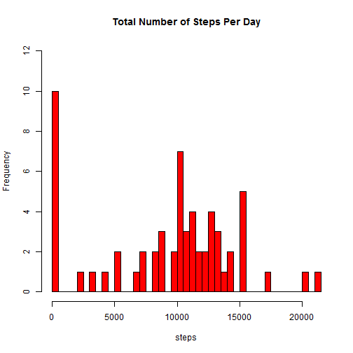
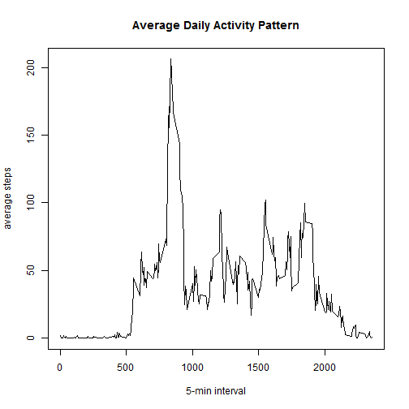
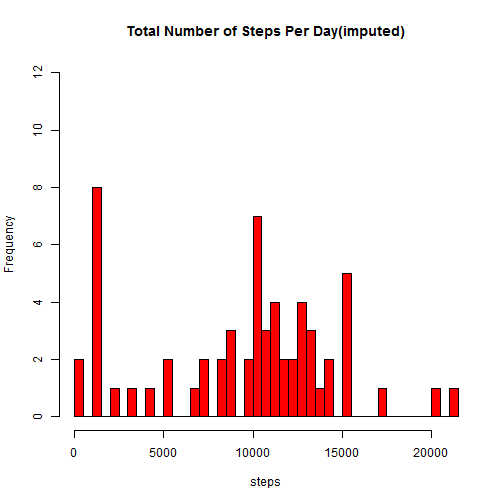
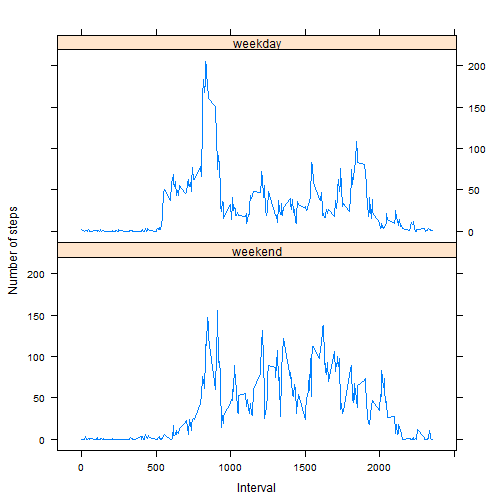

## Loading and preprocessing the data

```r
# read csv file and convert to data.table frame.
library(data.table)
suppressWarnings(
  unzip('activity.zip',files=NULL, list=FALSE, overwrite=FALSE))
DT <- as.data.table(read.csv('activity.csv'))
```


## What is mean total number of steps taken per day?

```r
# use data.table group-by function.
# TSPD: Total Steps Per Day
TSPD <- DT[,sum(steps, na.rm=TRUE), by=date]
setnames(TSPD,2,'steps')
```
### histogram of steps

```r
hist(TSPD$steps,breaks=nrow(TSPD),col='red',
      main='Total Number of Steps Per Day',
      xlab='steps',ylim=c(0,12))
```

 

### mean & median

```r
mean(TSPD$steps)
```

```
## [1] 9354.23
```

```r
median(TSPD$steps)
```

```
## [1] 10395
```


## What is the average daily activity pattern?
### time series plot

```r
avg_activity <- DT[,mean(steps, na.rm=TRUE), by=interval]
setnames(avg_activity, 2, 'mean_steps')
plot(x=avg_activity$interval, y=avg_activity$mean_steps, 
     type="l",
     main="Average Daily Activity Pattern",
     xlab="5-min interval", ylab="average steps")
```

 

### finding the interval containing maximum number of steps 

```r
# to verify 
max(avg_activity$mean_steps)
```

```
## [1] 206.1698
```

```r
max_row <- 
  avg_activity[order(avg_activity$mean_steps,decreasing=TRUE)[1]]
max_row
```

```
##    interval mean_steps
## 1:      835   206.1698
```

```r
max_row$interval
```

```
## [1] 835
```

## Imputing missing values
### total number of missing values in the dataset

```r
sum(is.na(DT$steps))
```

```
## [1] 2304
```

### filling missing values as median value

```r
med_activity <- DT[,median(steps, na.rm=TRUE), by=interval]
setnames(med_activity, 2, 'median_steps')
# make copy dataset
DT2 <- as.data.table(read.csv('activity.csv'))
# join with the key 'interval'
setkey(DT2, interval)
DT2[med_activity, steps := ifelse(is.na(steps),median_steps,steps)]
```

```
##        steps       date interval
##     1:     0 2012-10-01        0
##     2:     0 2012-10-02        0
##     3:     0 2012-10-03        0
##     4:    47 2012-10-04        0
##     5:     0 2012-10-05        0
##    ---                          
## 17564:     0 2012-11-26     2355
## 17565:     0 2012-11-27     2355
## 17566:     0 2012-11-28     2355
## 17567:     0 2012-11-29     2355
## 17568:     0 2012-11-30     2355
```

### imputed dataset histogram

```r
# use data.table group-by function.
# TSPD: Total Steps Per Day
TSPD2 <- DT2[,sum(steps), by=date]
setnames(TSPD2,2,'steps')
hist(TSPD2$steps,breaks=nrow(TSPD),col='red',
      main='Total Number of Steps Per Day(imputed)',
      xlab='steps',ylim=c(0,12))
```

 

### imputed dataset mean & median

```r
mean(TSPD2$steps)
```

```
## [1] 9503.869
```

```r
median(TSPD2$steps)
```

```
## [1] 10395
```
- No difference in median value between the original and the imputed, because the imputed missing values were copied from median ones.

## Are there differences in activity patterns between weekdays and weekends?
### create two-level factors("weekday","weekend") into the imputed dataset

```r
d_type <- list()
d_type[["Sat"]] <- "weekend"
d_type[["Sun"]] <- "weekend"
d_type[["Mon"]] <- "weekday"
d_type[["Tue"]] <- "weekday"
d_type[["Wed"]] <- "weekday"
d_type[["Thu"]] <- "weekday"
d_type[["Fri"]] <- "weekday"
Sys.setlocale(locale='C')
```

```
## [1] "C"
```

```r
DT2[,daytype:=as.character(d_type[weekdays(strptime(date,"%Y-%m-%d"), abbreviate=T)])]
```

```
##        steps       date interval daytype
##     1:     0 2012-10-01        0 weekday
##     2:     0 2012-10-02        0 weekday
##     3:     0 2012-10-03        0 weekday
##     4:    47 2012-10-04        0 weekday
##     5:     0 2012-10-05        0 weekday
##    ---                                  
## 17564:     0 2012-11-26     2355 weekday
## 17565:     0 2012-11-27     2355 weekday
## 17566:     0 2012-11-28     2355 weekday
## 17567:     0 2012-11-29     2355 weekday
## 17568:     0 2012-11-30     2355 weekday
```

### make panel plots (weekday vs. weekend)

```r
library(lattice)
avg_steps_on_daytype <- DT2[,mean(steps,na.rm=T),by=list(interval,daytype)]
setnames(avg_steps_on_daytype, 3, "avg_steps")
dt.f <- factor(avg_steps_on_daytype$daytype, 
               levels=c("weekend","weekday"))
xyplot(avg_steps ~ interval|dt.f, 
       data=avg_steps_on_daytype,type="l",layout=c(1,2),xlab="Interval",ylab="Number of steps")
```

 
